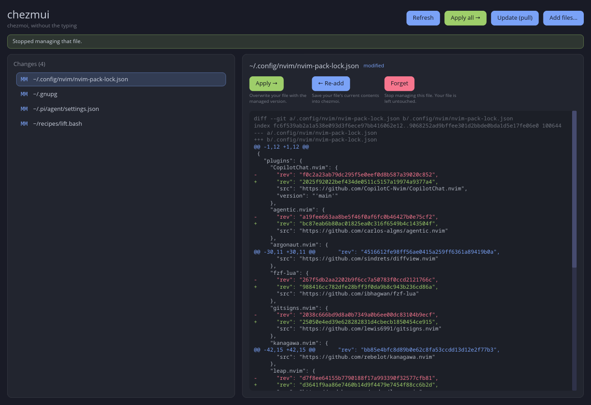

# chezmui

A small desktop GUI over the [`chezmoi`](https://www.chezmoi.io/) dotfile manager —
*chezmoi, without the typing*.

chezmui does one thing well: it shows what differs between your home directory and
the dotfiles chezmoi manages, and lets you act on each difference with a single
click. No need to remember command syntax or which direction a change flows.



## What it does

The left pane lists every managed file that currently differs (this is
`chezmoi status`). Select one to see its diff on the right, along with the actions
that make sense for it.

chezmoi's trickiest idea is that changes flow in two directions. chezmui names them
explicitly so you never have to keep them straight:

- **Apply →** — overwrite your file with the managed version (source → home).
- **← Re-add** — save your file's current contents back into chezmoi (home → source).
- **Forget** — stop managing a file. Your real file is left untouched.

The global actions across the top operate on everything at once:

- **Refresh** — re-read the status.
- **Apply all →** — push every managed change onto your home directory.
- **Update (pull)** — `chezmoi update`: pull from the remote and apply.
- **Add files…** — open a native file picker to start managing new files.

Diffs are syntax-coloured the way a terminal pager would render them: additions in
green, removals in red, hunk headers in the accent colour.

## Requirements

- The [`chezmoi`](https://www.chezmoi.io/install/) CLI, installed and on your `PATH`.
  chezmui never touches your dotfiles directly — every operation shells out to
  `chezmoi`, so it respects your existing chezmoi setup.
- A Rust toolchain supporting **edition 2024** (Rust 1.85 or newer) to build.
- The sibling [`iced-themer`](../iced-themer) crate, expected at `../iced-themer`
  relative to this repository (it is referenced as a local path dependency).

## Building and running

```sh
cargo run --release
```

Or build the binary and run it from anywhere:

```sh
cargo build --release
./target/release/chezmui
```

The theme is embedded into the binary at compile time, so the app looks the same
no matter which directory you launch it from.

## How it's built

- **[iced](https://iced.rs/) 0.14** for the UI, using the **tiny-skia** CPU
  renderer rather than a GPU backend. This is deliberate: it avoids GPU context
  loss across suspend/resume on Linux.
- Wayland and X11 are both supported.
- The UI is a thin presentation layer. Everything that knows how to talk to
  chezmoi lives in [`src/chezmoi.rs`](src/chezmoi.rs); the iced application
  (state, update, view) lives in [`src/main.rs`](src/main.rs).

## Theming

Colours, fonts, and panel styling come from [`theme.toml`](theme.toml), which is
consumed by the `iced-themer` crate and embedded at build time. Edit the
`[variables]` and `[palette]` sections to recolour the app, then rebuild.

## Status

A personal tool. It is not published to crates.io and carries no stability
guarantees.
